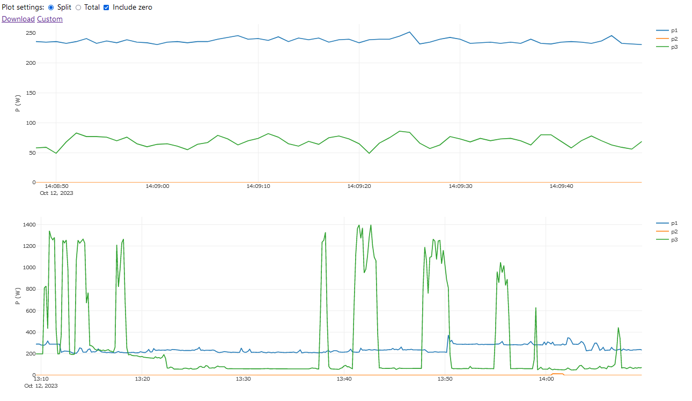
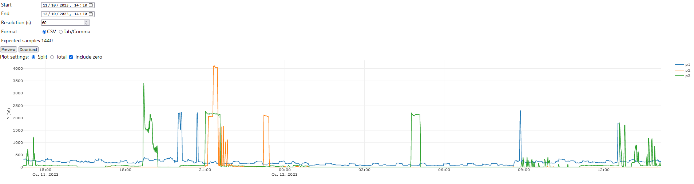
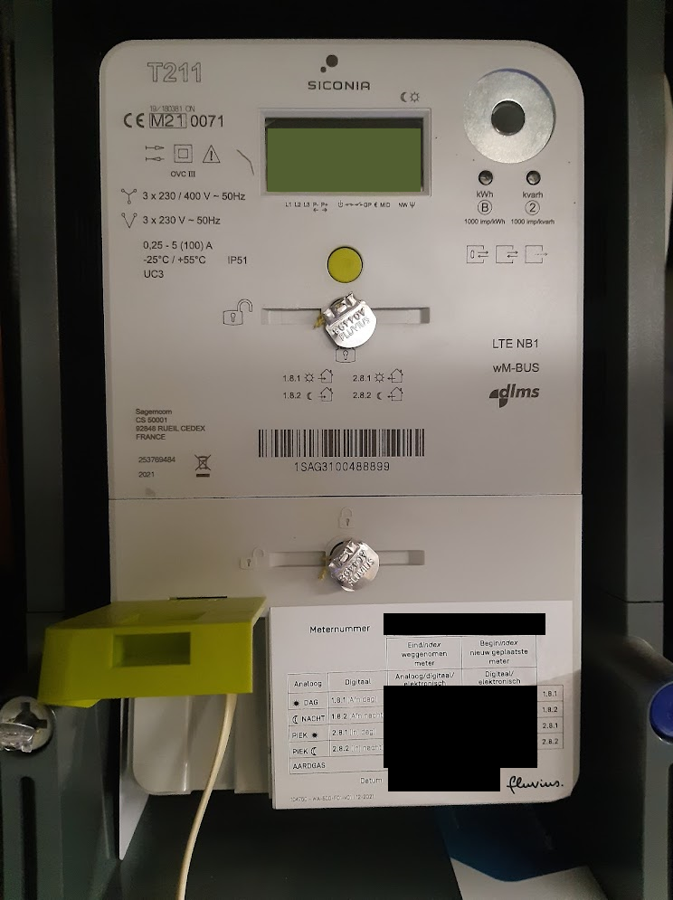
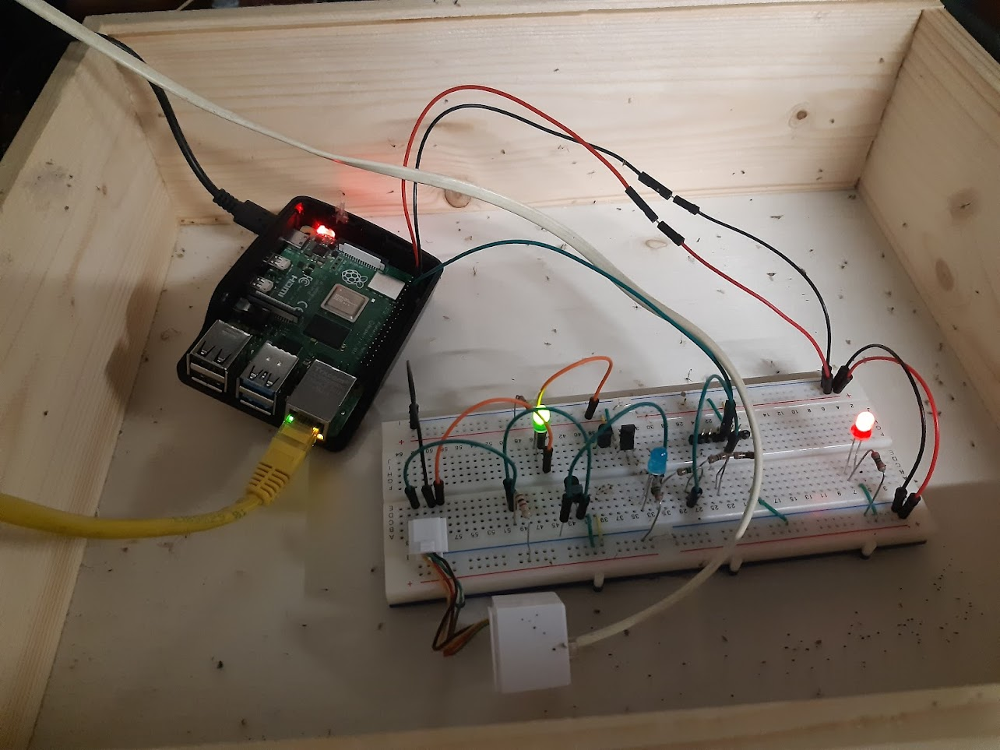
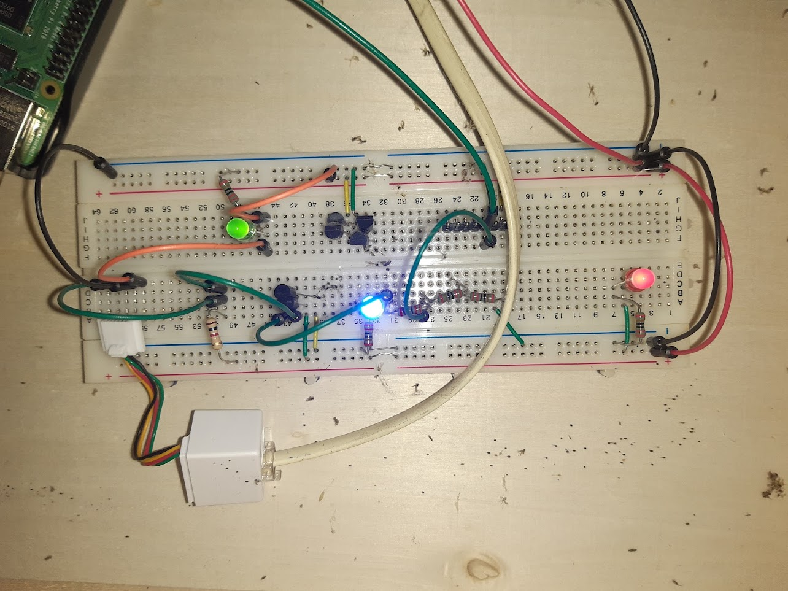

# DigitalMeter

## Overview

A raspberry-pi based webserver to display live updating power usage graphs. 

Incoming data is read through the P1 port over a RJ12 cable, following the [P1 companion standard of the Dutch Smart Meter Requirements](https://www.netbeheernederland.nl/_upload/Files/Slimme_meter_15_a727fce1f1.pdf), also used in Belgium.

A bit of breadboard circuitry is used to match the 5V levels of the P1 port to the 3.3V levels of the Raspberry Pi:
* a simple resistive voltage divider to lower the data signals
* two sequential inverters built from transistor to raise the control signal

Data is stored long-term in a SQLite database, and displayed in a web interface using [Plotly.js](https://plotly.com/javascript/).

The main page shows graphs of for different time ranges  (last minute, hour, day, week), and a dedicated custom page allows the user to select a custom time period and resolution to display. Data from this custom time range can be downloaded as a csv file.

## Pictures

Main page with default plots:

Custom time range and download page:

Meter connection:

Raspberry pi and breadboard setup:

Breadboard closeup, with status leds for power (red), enable (green) and data (blue):

